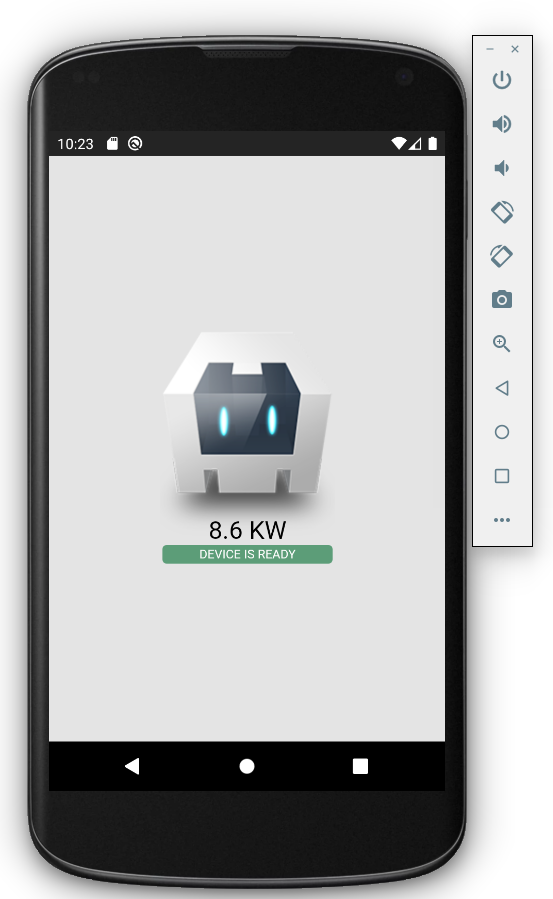
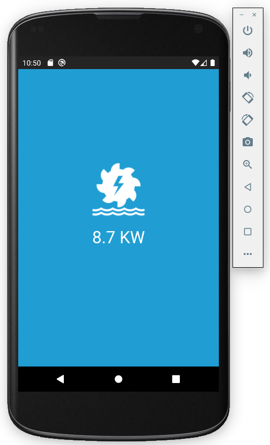

## Example 1: Live Display

This example modifies the basic Cordova Hello World example to fetch a live power value from an Emoncms feed to display as a live display. It covers using the Advanced HTTP Cordova Plugin to make the HTTP request.

1\. Create new project:

    cordova create Example1
    
2\. Add android platform and cordova-plugin-advanced-http plugin:

    cd MyElectric
    cordova platform add android
    cordova plugin add cordova-plugin-advanced-http

3\. Open *Example1/www/index.html* and add an id property to the main heading, We will be replacing this heading with the real-time power value.

    <h1 id="live">Apache Cordova</h1>
    
4\. Open *Example1/www/js/index.js*. Add a function called *updateValue* below *onDeviceReady* with the cordova http get request as given in the code snippet below. Call this function from *onDeviceReady* and setup a interval to provide a regular 10s update:

    // deviceready Event Handler
    //
    // Bind any cordova events here. Common events are:
    // 'pause', 'resume', etc.
    onDeviceReady: function() {
        this.receivedEvent('deviceready');
        
        app.updateValue();
        // Update every 5s with setInterval
        setInterval(app.updateValue,10000);
        
    },
    
    updateValue: function() {
        // Make a HTTP request with Cordova Advanced HTTP Plugin
        cordova.plugin.http.get('https://emoncms.org/feed/value.json', {
            // Emoncms.org feed 166913 is a community hydro scheme near Llanberis North Wales
            id: '166913'
        }, { }, function(response) {
            // Update the heading with the live value
            document.getElementById("live").innerHTML = (response.data*0.001).toFixed(1)+" kW";
            // console.log(response.status);
        }, function(response) {
            // console.error(response.error);
        });
    },
    
4\. Deploy:

    cordova run android --device

or:

    cordova run android --emulator

The result should look like this:

5\. At this point you may like to experiment with the html and css to make something more custom.

See full Example1 code here [Example1/www](Example1/www)

