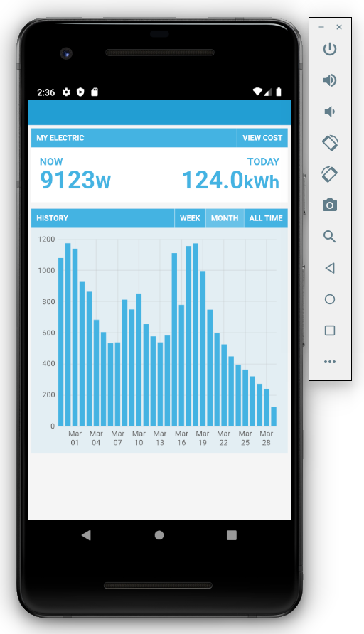

## Example 2: MyElectric

This example adapts the Emoncms app MyElectric2 into a Cordova app.

1\. Create new project:

    cordova create MyElectric

2\. Add android platform and cordova-plugin-advanced-http plugin:

    cd MyElectric
    cordova platform add android
    cordova plugin add cordova-plugin-advanced-http

3\. Overwrite www directory with MyElectric/www example code from this repository.
    
4\. Deploy:

    cordova run android --device
