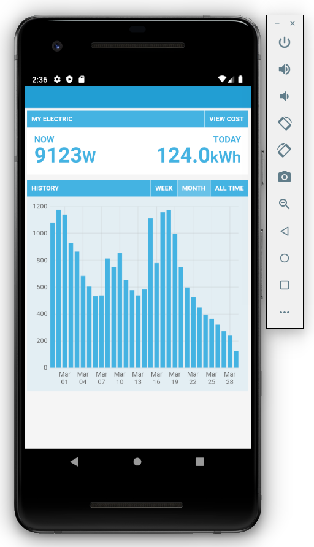

# Cordova Testing

## Installation

- [Basic Cordova Hello World](https://cordova.apache.org/)
- [Cordova Android Platform Installation Guide](https://cordova.apache.org/docs/en/latest/guide/platforms/android/index.html)

### 1. Node JS

    curl -sL https://deb.nodesource.com/setup_13.x | sudo -E bash -
    sudo apt-get install -y nodejs

    node -v
    v13.12.0

### 2. Java

    apt-get install software-properties-common
    add-apt-repository ppa:linuxuprising/java
    apt-get update
    apt-get install oracle-java13-installer

### 3. Gradle

    apt-get install unzip zip
    curl -s "https://get.sdkman.io" | bash
    source "/root/.sdkman/bin/sdkman-init.sh"
    sdk install gradle 6.3

### 4. Android Studio and SDK

https://developer.android.com/studio

In Android Studio > Configure > SDK Manager > SDK Platforms tab, I have Android 10 (Q) API level 29 and Android 9 (Pie) API level 28 installed.
Under the SDK Tools tab I have Android SDK Build Tools, Android Emulator, Android SDK Platform Tools and Android SDK Tools installed

I have the following directories in my Android/Sdk directory:

    build-tools  emulator  licenses  patcher  platforms  platform-tools  skins  sources  system-images  tools

### 5. bash_profile

In your home folder create a file called '.bash_profile' to hold relevant environment variables:

    [[ -s "$HOME/.profile" ]] && source "$HOME/.profile" # Load the default .profile

    [[ -s "$HOME/.rvm/scripts/rvm" ]] && source "$HOME/.rvm/scripts/rvm" # Load RVM into a shell session *as a function*

    export ANDROID_SDK_ROOT="$HOME/Android/Sdk"
    export ANDROID_HOME="$HOME/Android/Sdk"
    export PATH=$PATH:$ANDROID_HOME/emulator
    export PATH=$PATH:$ANDROID_HOME/tools
    export PATH=$PATH:$ANDROID_HOME/tools/bin
    export PATH=$PATH:$ANDROID_HOME/platform-tools

Load profile - every time you start a new bash window to create cordova applications - with: 

    source .bash_profile

### 6. Cordova

    sudo npm install -g cordova 

### 7. Hello World App

    cordova create MyApp

    cd MyApp
    cordova platform add browser
    cordova platform add android

Run on physical android device with Developer mode and USB debugging turned on:

    cordova run android --device
    
    
### 8. Example 1: MyElectric

    cd MyElectric
    cordova platform add android
    cordova plugin add cordova-plugin-advanced-http

Overwrite www directory with MyElectric example code from this repository.
    
Deploy:

    cordova run android --device
